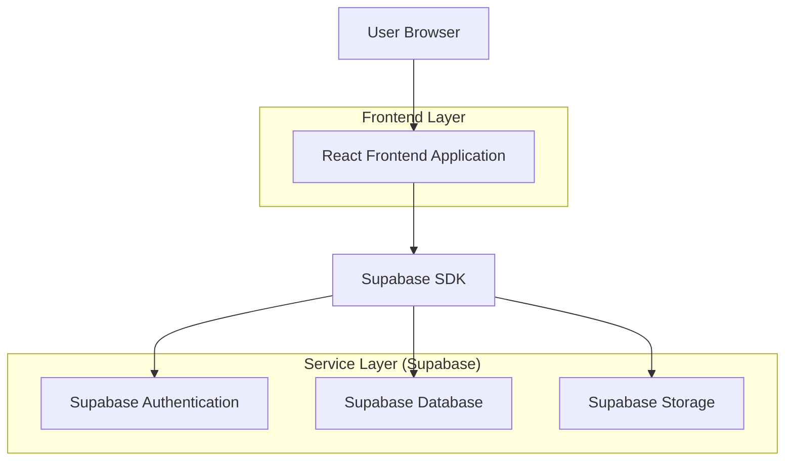
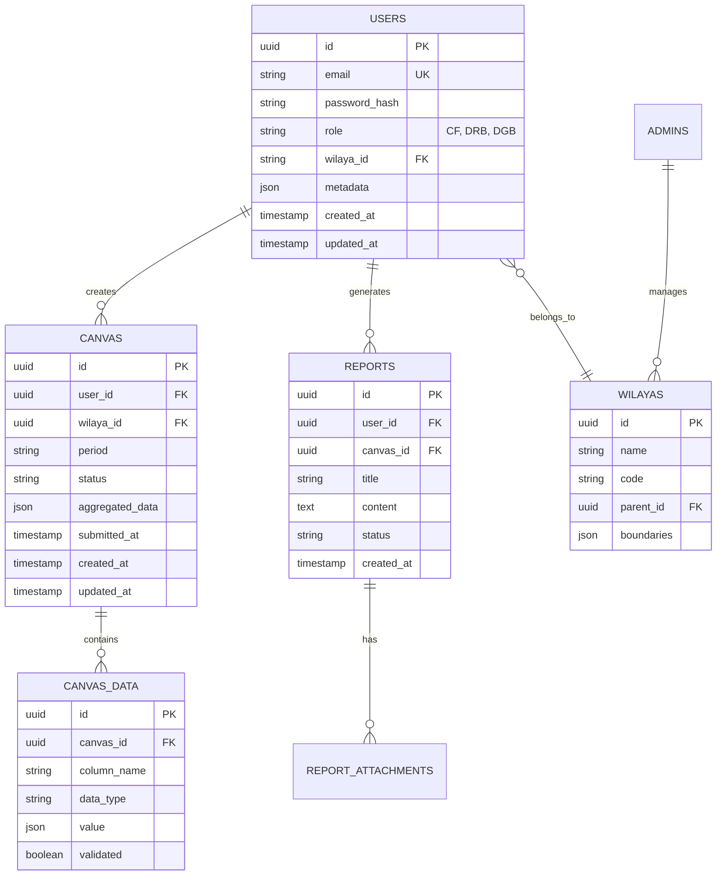

## 1. Architecture Design



## 2. Technology Description

- **Frontend**: React@18 + TypeScript + Vite + TailwindCSS@3 + shadcn/ui
- **Backend**: Supabase (Authentication, PostgreSQL Database, Storage)
- **State Management**: React Context + useReducer for complex state
- **Charts**: Recharts for statistical visualizations
- **Internationalization**: i18next for French/Arabic support
- **Form Handling**: React Hook Form + Zod validation
- **UI Components**: shadcn/ui components with custom styling

## 3. Route Definitions

| Route | Purpose | Role Access |
|-------|---------|-------------|
| /login | Authentication page with language selection | All roles |
| /dashboard | Statistical charts and analytics | All roles (filtered by level) |
| /templates | Canvas management and data entry | CF (User), DRB (Admin) |
| /users | User management interface | DRB (Admin), DGB (SuperAdmin) |
| /reports | Report generation and submission | CF (User), DRB (Admin) |
| /error | Error handling and system messages | All roles |
| /profile | User profile and settings | All roles |

## 4. API Definitions

### 4.1 Authentication APIs

```
POST /auth/v1/token
```

Request:
```json
{
  "email": "user@example.com",
  "password": "securepassword"
}
```

Response:
```json
{
  "access_token": "jwt_token",
  "token_type": "bearer",
  "expires_in": 3600,
  "refresh_token": "refresh_token",
  "user": {
    "id": "user_id",
    "email": "user@example.com",
    "role": "CF",
    "wilaya": "Algiers"
  }
}
```

### 4.2 Canvas Data APIs

```
GET /rest/v1/canvas
POST /rest/v1/canvas
PUT /rest/v1/canvas
DELETE /rest/v1/canvas
```

Canvas Data Structure:
```typescript
interface Canvas {
  id: string
  user_id: string
  wilaya_id: string
  period: string
  data: Record<string, any>
  status: 'draft' | 'submitted' | 'approved'
  created_at: string
  updated_at: string
}
```

## 5. Data Model

### 5.1 Entity Relationship Diagram



### 5.2 Data Definition Language

```sql
-- Users table with role-based access
CREATE TABLE users (
  id UUID PRIMARY KEY DEFAULT gen_random_uuid(),
  email VARCHAR(255) UNIQUE NOT NULL,
  password_hash VARCHAR(255) NOT NULL,
  role VARCHAR(10) NOT NULL CHECK (role IN ('CF', 'DRB', 'DGB')),
  wilaya_id UUID REFERENCES wilayas(id),
  metadata JSONB DEFAULT '{}',
  created_at TIMESTAMP WITH TIME ZONE DEFAULT NOW(),
  updated_at TIMESTAMP WITH TIME ZONE DEFAULT NOW()
);

-- Wilayas (regions) table
CREATE TABLE wilayas (
  id UUID PRIMARY KEY DEFAULT gen_random_uuid(),
  name VARCHAR(100) NOT NULL,
  code VARCHAR(10) UNIQUE NOT NULL,
  parent_id UUID REFERENCES wilayas(id),
  boundaries JSONB,
  created_at TIMESTAMP WITH TIME ZONE DEFAULT NOW()
);

-- Canvas main table
CREATE TABLE canvas (
  id UUID PRIMARY KEY DEFAULT gen_random_uuid(),
  user_id UUID REFERENCES users(id) ON DELETE CASCADE,
  wilaya_id UUID REFERENCES wilayas(id),
  period VARCHAR(20) NOT NULL,
  status VARCHAR(20) DEFAULT 'draft' CHECK (status IN ('draft', 'submitted', 'approved', 'rejected')),
  aggregated_data JSONB DEFAULT '{}',
  submitted_at TIMESTAMP WITH TIME ZONE,
  created_at TIMESTAMP WITH TIME ZONE DEFAULT NOW(),
  updated_at TIMESTAMP WITH TIME ZONE DEFAULT NOW()
);

-- Canvas data details
CREATE TABLE canvas_data (
  id UUID PRIMARY KEY DEFAULT gen_random_uuid(),
  canvas_id UUID REFERENCES canvas(id) ON DELETE CASCADE,
  column_name VARCHAR(100) NOT NULL,
  data_type VARCHAR(50) NOT NULL,
  value JSONB,
  validated BOOLEAN DEFAULT FALSE,
  created_at TIMESTAMP WITH TIME ZONE DEFAULT NOW(),
  updated_at TIMESTAMP WITH TIME ZONE DEFAULT NOW()
);

-- Reports table
CREATE TABLE reports (
  id UUID PRIMARY KEY DEFAULT gen_random_uuid(),
  user_id UUID REFERENCES users(id) ON DELETE CASCADE,
  canvas_id UUID REFERENCES canvas(id) ON DELETE CASCADE,
  title VARCHAR(255) NOT NULL,
  content TEXT,
  status VARCHAR(20) DEFAULT 'draft' CHECK (status IN ('draft', 'submitted', 'approved')),
  created_at TIMESTAMP WITH TIME ZONE DEFAULT NOW(),
  updated_at TIMESTAMP WITH TIME ZONE DEFAULT NOW()
);

-- Create indexes for performance
CREATE INDEX idx_users_role ON users(role);
CREATE INDEX idx_users_wilaya ON users(wilaya_id);
CREATE INDEX idx_canvas_user ON canvas(user_id);
CREATE INDEX idx_canvas_wilaya ON canvas(wilaya_id);
CREATE INDEX idx_canvas_status ON canvas(status);
CREATE INDEX idx_canvas_period ON canvas(period);
CREATE INDEX idx_canvas_data_canvas ON canvas_data(canvas_id);
CREATE INDEX idx_reports_user ON reports(user_id);
CREATE INDEX idx_reports_canvas ON reports(canvas_id);

-- Row Level Security (RLS) policies
ALTER TABLE canvas ENABLE ROW LEVEL SECURITY;
ALTER TABLE canvas_data ENABLE ROW LEVEL SECURITY;
ALTER TABLE reports ENABLE ROW LEVEL SECURITY;

-- User can only see their own canvases
CREATE POLICY "Users can view own canvas" ON canvas
  FOR SELECT USING (auth.uid() = user_id);

-- Admin can see all canvases in their wilaya
CREATE POLICY "Admins can view regional canvas" ON canvas
  FOR SELECT USING (
    EXISTS (
      SELECT 1 FROM users 
      WHERE users.id = auth.uid() 
      AND users.role = 'DRB' 
      AND users.wilaya_id = canvas.wilaya_id
    )
  );

-- SuperAdmin can see all canvases
CREATE POLICY "SuperAdmin can view all canvas" ON canvas
  FOR SELECT USING (
    EXISTS (
      SELECT 1 FROM users 
      WHERE users.id = auth.uid() 
      AND users.role = 'DGB'
    )
  );

-- Grant permissions
GRANT SELECT ON canvas TO anon;
GRANT ALL PRIVILEGES ON canvas TO authenticated;
GRANT SELECT ON canvas_data TO anon;
GRANT ALL PRIVILEGES ON canvas_data TO authenticated;
```

## 6. Component Architecture

### 6.1 Frontend Component Structure

```
src/
├── components/
│   ├── common/
│   │   ├── Header.tsx
│   │   ├── Sidebar.tsx
│   │   ├── LanguageSwitcher.tsx
│   │   └── NotificationBadge.tsx
│   ├── auth/
│   │   ├── LoginForm.tsx
│   │   └── ProtectedRoute.tsx
│   ├── canvas/
│   │   ├── CanvasTable.tsx
│   │   ├── CanvasFilters.tsx
│   │   ├── CanvasEditor.tsx
│   │   └── CanvasValidation.tsx
│   ├── charts/
│   │   ├── StatisticsChart.tsx
│   │   ├── ChartFilters.tsx
│   │   └── ChartExport.tsx
│   ├── users/
│   │   ├── UserTable.tsx
│   │   ├── UserForm.tsx
│   │   └── UserPermissions.tsx
│   └── reports/
│       ├── ReportGenerator.tsx
│       ├── ReportAttachments.tsx
│       └── ReportHistory.tsx
├── hooks/
│   ├── useAuth.ts
│   ├── useCanvas.ts
│   ├── useStatistics.ts
│   └── useLanguage.ts
├── contexts/
│   ├── AuthContext.tsx
│   ├── LanguageContext.tsx
│   └── NotificationContext.tsx
└── utils/
    ├── supabase.ts
    ├── validation.ts
    └── i18n.ts
```

## 7. Security Considerations

- **Authentication**: Supabase Auth with JWT tokens
- **Authorization**: Role-based access control (RBAC) with RLS policies
- **Data Validation**: Client-side and server-side validation with Zod schemas
- **Input Sanitization**: XSS protection for all user inputs
- **File Upload**: Secure file storage with virus scanning
- **API Rate Limiting**: Implemented at Supabase level
- **Audit Logging**: Track all data modifications with user attribution